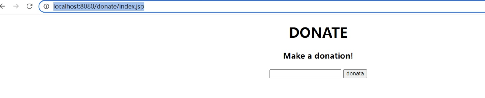
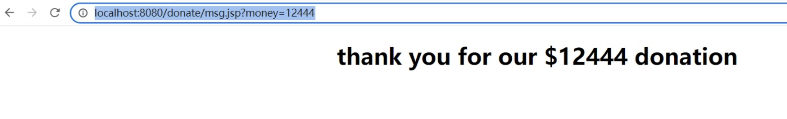
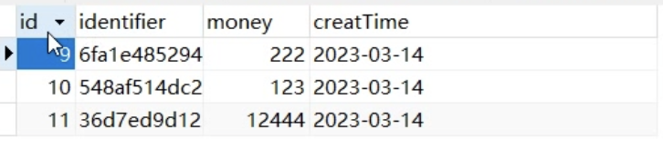
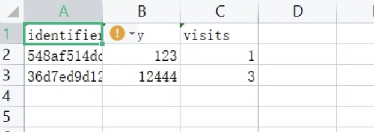

# README

# Donation Website

This is a donation webpage project programmed with Java, which randomly assigns one of two versions of the webpage to a user upon clicking the URL. The aim is to provide a personalized, engaging user experience while tracking user interactions and collecting relevant data.

## Project Features

1. **User Assignment**: When a user clicks on the URL, they are randomly assigned to one of two versions of the donation webpage. The assignment is user-specific and persistent; meaning the same user will always see the same version of the webpage upon revisiting.
2. **Donation Input**: On both versions of the webpage, there is a feature for users to enter a donation amount.
3. **Dynamic Prompts**: Depending on the version of the webpage assigned, the user will see a slightly different donation prompt: "Please make a donation!" or "Make a donation!".
4. **Donation Confirmation**: Upon entering a donation and clicking on the "Donate" button, users are redirected to a confirmation page that displays the message: "Thank you for your $X donation," where X represents the donated amount.
5. **Payment Processing**: This project includes a comprehensive guide on setting up a donation processing system, enabling users to make real-time donations.
6. **Data Collection**: The system collects and stores important user data for further analysis, which includes:
   - A unique identifier for each visitor (uses cookies for tracking).
   - The version of the site the user visited.
   - Whether a donation was made.
   - The size of the donation (if made).

## Demo images

